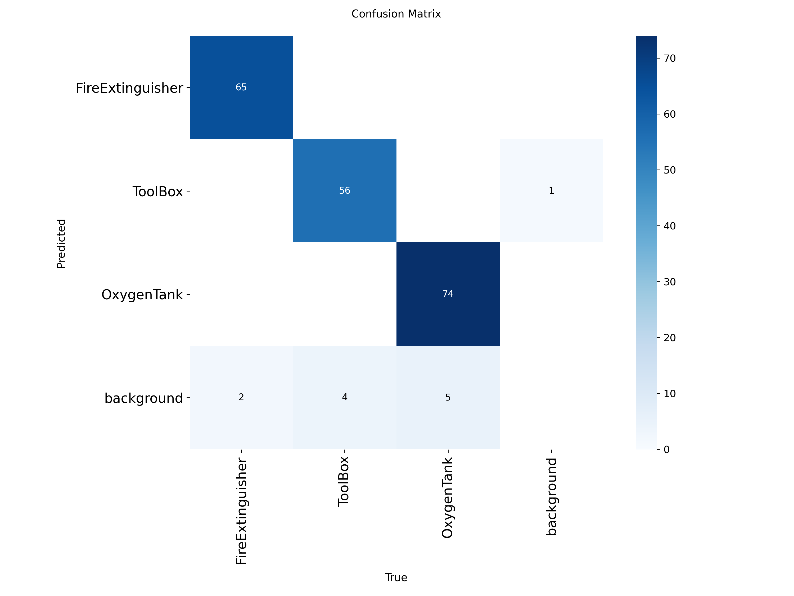

# Object Detection Model for Space Station


*Figure: Model achieving mAP@0.5 = 0.983 (see confusion matrix and training results below)*

---

## Project Overview

This project presents an **Object Detection Model for Space Station** built for a hackathon conducted by DualityAI. The model is based on **YOLOv8l** and is trained to detect three critical objects: **fire extinguisher**, **toolbox**, and **oxygen tank**. The dataset was provided by DualityAI, generated from their virtual digital twin simulator. Our model achieves a high mAP@0.5 of **0.983**.

---

## Features

- **YOLOv8l Model**: Fine-tuned for 3 space station safety objects.
- **High Accuracy**: Achieved mAP@0.5 = 0.983.
- **Multiple Applications**:
  1. **Web Application**: Upload an image and receive annotated detection results (as required by the hackathon).
  2. **Video Detection**: Detect objects in video files.
  3. **Real-Time Detection**: Detect objects live using a webcam.
- **Modern UI**: React-based frontend for the web app.
- **Easy Model Update**: Retrain and update weights as needed.

---

## Directory Structure

```
YOLO/
│
├── Real-time-live-detection/
│   └── realtime_detection.py
│
├── safety-detection-app/
│   ├── backend/
│   │   └── main.py
│   └── frontend/
│       └── src/
│           ├── pages/
│           └── App.jsx
│
├── runs/
│   └── detect/
│       └── train5/
│           ├── weights/
│           │   └── best.pt
│           ├── confusion_matrix.png
│           ├── results.png
│           └── ...
│
├── data/
│   ├── train/
│   ├── val/
│   ├── test/
│
├── predictions/
│   └── images/
│
├── Screenshot 2025-07-15 221436.png
├── train.py
├── predict.py
├── resume_train.py
├── visualize.py
├── classes.txt
├── yolo_params.yaml
└── yolov8l.pt
```

---

## Setup & Installation

### 1. Environment Setup

- Use the scripts in `ENV_SETUP/` for Windows:
  - `create_env.bat` – Create a virtual environment
  - `install_packages.bat` – Install required Python packages
  - `setup_env.bat` – Set environment variables

### 2. Backend

```bash
cd safety-detection-app/backend
pip install -r requirements.txt
uvicorn main:app --reload
```

### 3. Frontend

```bash
cd safety-detection-app/frontend
npm install
npm run dev
```

### 4. Real-Time Detection

```bash
cd Real-time-live-detection
python realtime_detection.py
```

---

## Dataset

- **Location:** `data/`
- **Structure:** YOLO format with `images/` and `labels/` for `train`, `val`, `test`
- **Classes:** `["fire extinguisher", "toolbox", "oxygen tank"]` (see `classes.txt`)

---

## Model Training

- **Script:** `train.py`
- **Model:** YOLOv8l (`yolov8l.pt` as base, fine-tuned)
- **Parameters:** See `yolo_params.yaml`
- **Weights:** Best model at `runs/detect/train5/weights/best.pt`

---

## Applications

### 1. Web Application

- **Backend:** FastAPI (`safety-detection-app/backend/main.py`)
- **Frontend:** React (`safety-detection-app/frontend/src/`)
- **Function:** Upload an image and get detection results with annotated output.
- **Usage:**  
  - Start backend and frontend as described above.
  - Access the app at `http://localhost:5173`.

### 2. Video Detection

- **Script:** Use `predict.py` or adapt `realtime_detection.py` for video files.
- **Function:** Detect objects in video files and save annotated outputs.

### 3. Real-Time Detection

- **Script:** `Real-time-live-detection/realtime_detection.py`
- **Function:** Detect objects live using a webcam or IP camera.
- **Usage:**
  ```bash
  python realtime_detection.py --source 0
  # For IP camera: python realtime_detection.py --source http://<ip>:<port>/video
  # To save output: python realtime_detection.py --output output.mp4
  # For CPU: python realtime_detection.py --device cpu
  # Adjust confidence: python realtime_detection.py --conf 0.6
  ```

---

## Evaluation & Results

- **mAP@0.5:** 0.983 (see screenshot above)
- **Confusion Matrix:**  
  
- **Other Metrics:** See `runs/detect/train5/results.png`, etc.

---

## Sample Predictions

- **Location:** `predictions/images/`
- **How to Generate:** Use `predict.py` or the web app to run inference on new images.

---

## Updating the Model

1. **Collect New Data:** Add new images to `data/`.
2. **Annotate:** Label new data in YOLO format.
3. **Retrain:** Run `train.py` with updated data.
4. **Update Weights:** Replace `best.pt` in both apps.
5. **Validate:** Check results and update as needed.

---

## Acknowledgements

- **DualityAI** for organizing the hackathon and providing the dataset via their virtual digital twin simulator.

---

**For any questions, contact the project maintainer.**

---

**Note:**  
- Update image links if you move or rename screenshots.
- Add more details or sections as your project evolves.
